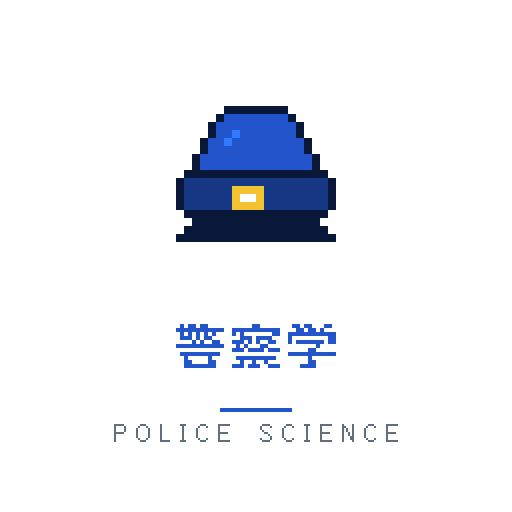
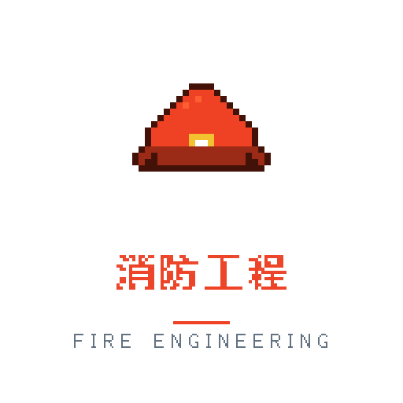
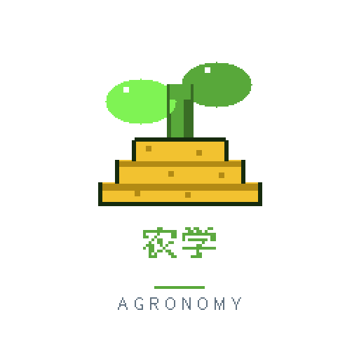
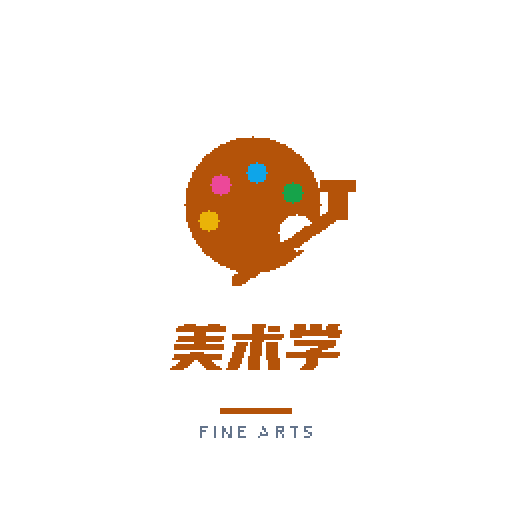
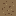
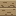
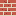

# PIXEL VAULT · 像素素材库

> 通用全量像素艺术素材库 · A general-purpose pixel-art asset vault
> **在线浏览 / Browse online:** https://fanquanpp.github.io/pixel-vault/

[](LICENSE)


像素专业头像、游戏 UI、地形贴图、矢量图标 —— 每一件像素作品都附带 **Aseprite 源文件（.aseprite）**，可自由编辑。全部素材以 **MIT 协议** 开源，可自由用于个人与商业项目。

Professional pixel-art avatars, game UI, tiles and vector icons — every pixel piece ships with its editable **Aseprite source file**. All assets are released under the **MIT License**.

> 文档 / Docs：[内容说明 CONTENT.md](CONTENT.md) · [免责声明 DISCLAIMER.md](DISCLAIMER.md) · [LICENSE](LICENSE)

---

## 内容一览 / What's Inside

| 目录 / Dir | 内容 / Content | 数量 |
|---|---|---|
| `avatars/` | 像素专业方向头像（512px，11 大类目）Pixel majors avatars | 110 组 |
| `game/pixel-ui-pack/` | 16×16 像素 UI 包：红心/金币/宝石/宝箱/按钮/面板 UI pack | 17 件 |
| `game/pixel-ui-pack-hd/` | 32×32 精雕 HD 版：心/金币/宝石/钥匙/药水/星（5 阶色带+抖动+镜面高光） | 6 件 |
| `game/pixel-tiles/` | 16×16 地形贴图：草/土/石/沙/砖/水… Tiles | 8 块 |
| `game/speed-rouge/` | 平台跳跃游戏全套素材（机关/建筑/关卡/FX/角色）Full platformer set | 151 |
| `icons/file-icons/` | 32×32 开发者文件图标（git/html/css/js/ts/json/md/svg/png/zip/folder/jekyll） | 12 枚 |
| `icons/vector/` | 扁平矢量图标（SVG，8 组）Flat SVG icons | 69 |
| `branding/` | Logo、社交卡片等品牌资产 | 3 |

**头像类目 / Avatar categories:** 计算机软件 · 电子信息 · 机械自动化 · 土木建筑 · 医学健康 · 经济管理 · 人文法学 · 教育体育 · 理学 · 艺术设计 · 公共服务（新）

## 预览 / Preview

<p align="center">
  
  
  
  
  
</p>
<p align="center">
  
  
  
  
  
  
  
  
  
  
  
</p>
<p align="center">
  
  
  
  
  
  
</p>
<p align="center">
  
  
  
  
  
  
  
  
  
  
</p>
<p align="center">
  
  
  
  
  
  
  
  
  
</p>

## 使用 / Usage

- **浏览 / Browse:** 打开上方在线展示站，或仓库内 `index.html`（附搜索、分类、灯箱、一键下载）。
- **取用 / Grab:** 直接下载 PNG/SVG；需要改色改形请下载对应的 `.aseprite` 源文件（带 [Aseprite](https://www.aseprite.org/) 打开即可）。
- **头像规格 / Avatars:** 512×512 导出图，源文件 256×256 分层（`bg` / `icon` / `text`）。
- **游戏素材规格 / Game assets:** 16×16 原生尺寸，放大时请使用最近邻插值（`image-rendering: pixelated`）。

```html
<!-- 网页中使用像素图 / crisp pixels on the web -->

```

## 目录结构 / Structure

```
pixel-vault/
├── index.html · style.css · app.js · manifest.json   ← 展示站 showcase site
├── avatars/            像素专业头像（11 类目 + legacy）
├── game/
│   ├── pixel-ui-pack/  16×16 UI 包 
│   ├── pixel-tiles/    16×16 地贴 
│   ├── speed-rouge/    平台游戏全套素材
│   └── bianqv/
├── icons/              vector(SVG) · speed-rouge
└── branding/           社交卡 · logos
```

## 协议 / License

[MIT](LICENSE) © 2026 Atian (fanquanpp) — 可自由使用、修改、商用，请保留版权声明。

> 字体说明 / Font note: 头像文字使用开源 [Fusion Pixel Font](https://github.com/TakWolf/fusion-pixel-font)（OFL）。
